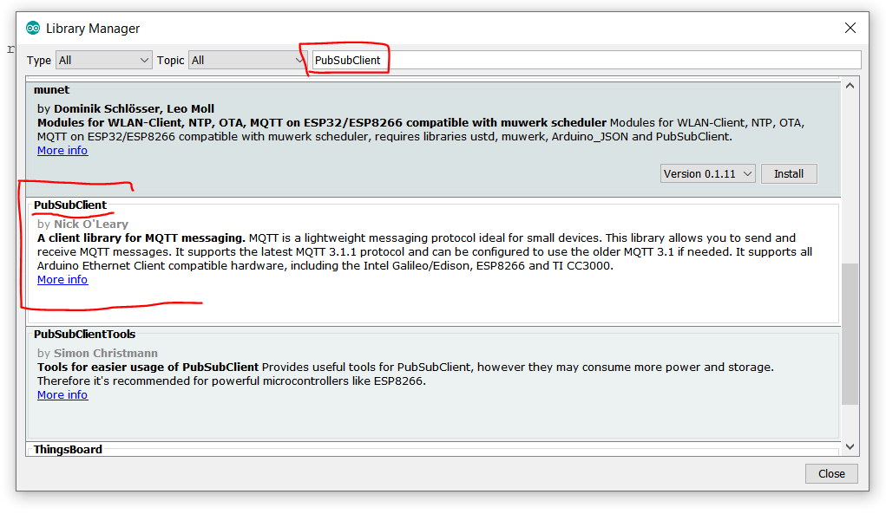
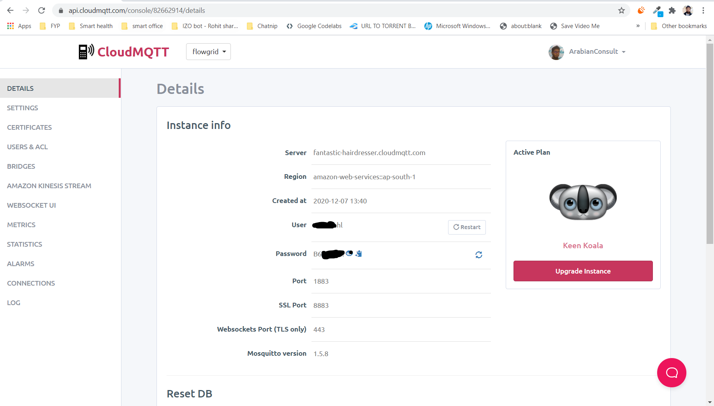

pubsubclient docs:

https://pubsubclient.knolleary.net/api#state

Publish and subscribe from esp32 wifi chip:
https://randomnerdtutorials.com/esp32-mqtt-publish-subscribe-arduino-ide/
https://techtutorialsx.com/2017/04/09/esp8266-connecting-to-mqtt-broker/